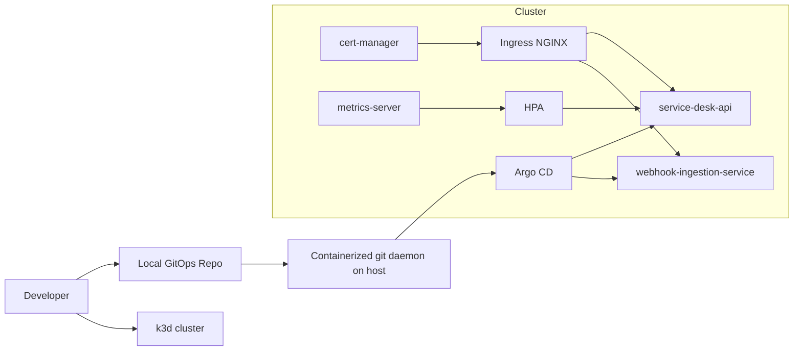

# Architecture

## Main flow

1. A local bare Git repository is exposed through a lightweight containerized `git daemon`.
2. `Argo CD` watches that repository inside the `k3d` cluster.
3. The repository contains `Helm` charts for `service-desk-api` and `webhook-ingestion-service`.
4. `Ingress NGINX` exposes both workloads.
5. `cert-manager` issues self-signed local certificates.
6. `metrics-server` provides CPU metrics for HPA and `kubectl top`.

## Why the workloads are simplified

This lab proves GitOps delivery, not the complete dependency topology of every workload. The workloads therefore run in their minimal API-ready modes:

- `service-desk-api` uses SQLite and keeps async tasks disabled.
- `webhook-ingestion-service` uses SQLite and the inline queue backend.

This keeps the cluster light and makes rollout/rollback validation much more reliable on a local developer machine.
